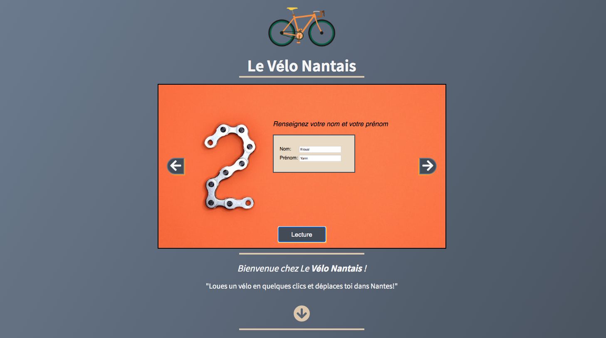
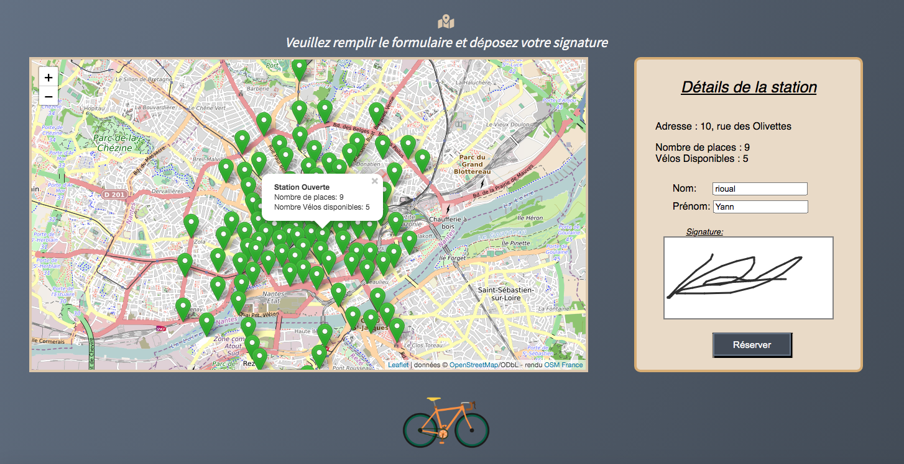

# projet3 - Formation Développeur web Junior OpenClassrooms - Concevez une carte interactive de location de vélos

<h2>Compétences évaluées</h2>
<h3>Créer des objets simples en JavaScript, contenant des méthodes et des propriété</h3>
<ul>
  <li>Le code JavaScript est développé en Orienté Objet</li>
  <li>Le diaporama est conforme et fonctionnel</li>
  <li>Aucun plugin n’est utilisé pour la logique de l’application (Diaporama, Canvas, Carte)</li>
</ul>
<h3>Récupérer des données de formulaires en utilisant le langage JavaScript</h3>
<ul>
  <li>Le canvas est fonctionnel</li>
  <li>Le nom et prénom utilisent l’API LocalStorage</li>
  <li>Les données de réservation sont affichées en dessous de la carte, s'il y a une réservation en cours</li>
</ul>
<h3>Faire des requêtes HTTP en langage JavaScript</h3>
<ul>
  <li>La carte est récupérée dynamiquement depuis un web service cartographique</li>
  <li>Les informations sur les stations utilisent l’API Live de JC Decaux</li>
</ul>
<h3>Écrire un code source lisible</h3>
<ul>
  <li>Le code est correctement indenté</li>
  <li>Les noms de classes, de méthode et de variables sont explicites (indifféremment en français ou en anglais)</li>
  <li>Il y a une seule classe par fichier</li>
</ul>

Homepage Carousel Screenshot

Map & Reservation Screenshot

